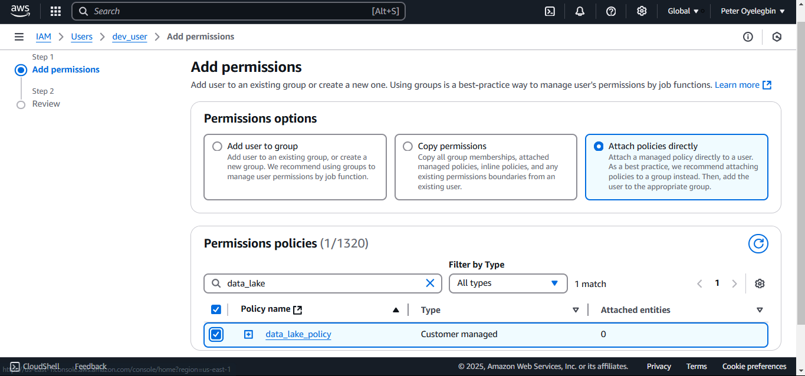

# 30 Days DevOps Challenge - NBADataLake
This repository contains the setup_nba_data_lake.py script, which automates the creation of a data lake for NBA analytics using AWS services. The script integrates Amazon S3, AWS Glue, and Amazon Athena, and sets up the infrastructure needed to store and query NBA-related data.
- Amazon S3: For sending SMS and email notifications.
- AWS Glue: To process and handle API data and notifications.
- Amazon Athena: For scheduling automation tasks.
- NBA APIs: For fetching live game scores.


## Features
The setup_nba_data_lake.py script performs the following actions:
- Creates an Amazon S3 bucket to store raw and processed data.
- Uploads sample NBA data (JSON format) to the S3 bucket.
- Creates an AWS Glue database and an external table for querying the data.
- Configures Amazon Athena for querying data stored in the S3 bucket.


## Step-by-Step Procedure
1. **Setup SportsData.io:**
    - Create a free account at [sportsdata.io](https://sportsdata.io).
    - Obtain your NBA API key.

2. **Clone the project**
    ```bash
    git clone https://api.sportsdata.io/v3/nba/scores/json/Players
    ```

3. **Create .env file:**
    ```bash
    SPORTS_DATA_API_KEY=your_sportsdata_api_key
    NBA_ENDPOINT=https://api.sportsdata.io/v3/nba/scores/json/Players
    AWS_BUCKET_NAME=your_bucket_name
    GLUE_DATABASE_NAME=your_glue_database_name
    ```

4. **Update the IAM policy**
    - Navigate to **policies** tab on **IAM console**, then click **Create policy**
    
    - Switch to **JSON** and Copy the content of **policies/IAM_Role** to create a new policy as shown below
    
    - Provide a name for your policy, e.g., `data_lake_policy` as shown below.
    
    - Navigate to **user** tab on **IAM console**, then click the user to edit
    
    - Click **Add permissions** to add to the existing IAM user as shown below
    
    - Select **Attach policies directly** and add the created policy by using the search field
    


4. **Run the script:**
    ```bash
    python3 src/setup_nba_data_lake.py
    ```
    

5. **Manually Check For The Resources**
    - Check for bucket **otp-sports-analytics-data-lake** in **S3 resources**
    

    - Check the **raw-data** folder in **otp-sports-analytics-data-lake**
    

6. **Head over to Amazon Athena and you could paste the following sample query:**
    ```bash
    SELECT FirstName, LastName, Position, Team
    FROM "AwsDataCatalog"."glue_nba_data_lake"."nba_players"
    WHERE Position = 'PG';
    ```
    
    - Set your Athena output storage location to same S3 bucket created
    
    - Click Run and you should see an output if you scroll down under "Query Results"
    

7. **Run the delete_aws_resources script:**
    To delete created resources as shown below
    


## **What We Learned**
1. Securing AWS services with least privilege IAM policies.
2. Integrating external APIs into cloud-based workflows.
3. Automating the creation of services with a script.


## **Future Enhancements**
1. Automate data ingestion with AWS Lambda
2. Implement a data transformation layer with AWS Glue ETL
3. Add advanced analytics and visualizations (AWS QuickSight)
